# SimPPL – Social Media Explorer
Investigative Analytics & Narrative Intelligence Dashboard

An interactive Streamlit-based investigative dashboard built for the SimPPL Research Engineer Intern Assignment.
The system integrates semantic search, GenAI summaries, temporal analysis, multimodal analytics, and network visualization into a unified exploration tool.

# App Demo
Video_Demo: (https://drive.google.com/file/d/1v_7l2uXzMzHpa66vR1zNKbQhO8ys40d6/view?usp=sharing)

## Table of Contents

- [Overview](#overview)
- [Features](#features)
- [Installation](#installation)
- [Usage](#usage)
- [Conclusion](#conclusion)

## Overview

**Dataset Snapshot**
Instant visibility into post volume, active authors, viral content, and subreddit coverage.

**Trends & Timing**
Time-series views expose posting surges, weekly patterns, and keyword spikes.

**Semantic Search**
Embedding-based natural language search retrieves contextually relevant posts beyond keywords.

**AI Briefings**
Automated summaries convert complex engagement patterns into clear, event-linked insights.

**Topics & Sentiment**
Clustering and UMAP reveal narrative groups, with sentiment breakdown across clusters.

**Controversy Analysis**
Identifies viral hits versus polarizing debates using engagement and approval signals.

Network & Media Impact
Author–subreddit networks and media-type analysis uncover influence and engagement drivers.

## Features
The dashboard is organized into six investigative tabs, each telling a different part of the data story.

# Tab 1:  Trends & Volume
 - Post volume over time
 - Keyword frequency trends
Identifies temporal triggers and early amplifiers of narratives.

# Tab 2:  AI Briefing
 - GPT-powered executive summary
 - Offline event linking
Translates raw metrics into human-readable intelligence reports.

 # Tab 3:  Clusters & Topics
 - UMAP topic projection
 - Sentiment per cluster
Reveals how narratives fracture into sub-topics and emotional tones.

# Tab 4:  Controversy & Sources
 - Approval vs comment controversy matrix
 - Source distribution sunburst
Distinguishes viral consensus from polarizing debate.

# Tab 5: 🕸️ Network
 - Author–Subreddit bipartite graph
Identifies super-spreaders and coordination behavior.

# Tab 6: 📸 Media Impact
 - Media-type distribution
 - High-engagement image gallery
Shows how visual vs text content drives engagement.

# Assignment Requirements Coverage
 - Semantic Search (OpenAI Embeddings)
 - GenAI Summarization
 - Multimodal Analysis
 - Network Analysis
 - Professional documentation

## Screenshots

The following screenshots illustrate the dashboard’s functionality:

1. **Time Series Plot**  
   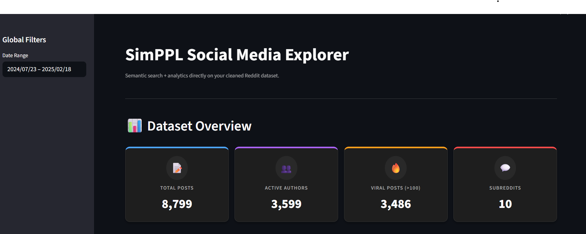  
   *High-level metrics that frame the scale and engagement of the dataset.*

2. **Global Activity & Participation Overview**  
   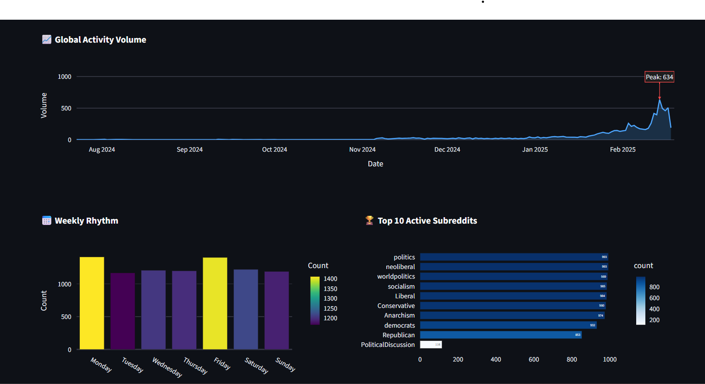  
   *Time-series plot showing overall posting volume over time, highlighting major activity peaks, alongside weekly posting rhythm and the top active subreddits contributing to the discussion.*

3. **Semantic Search on Posts**  
   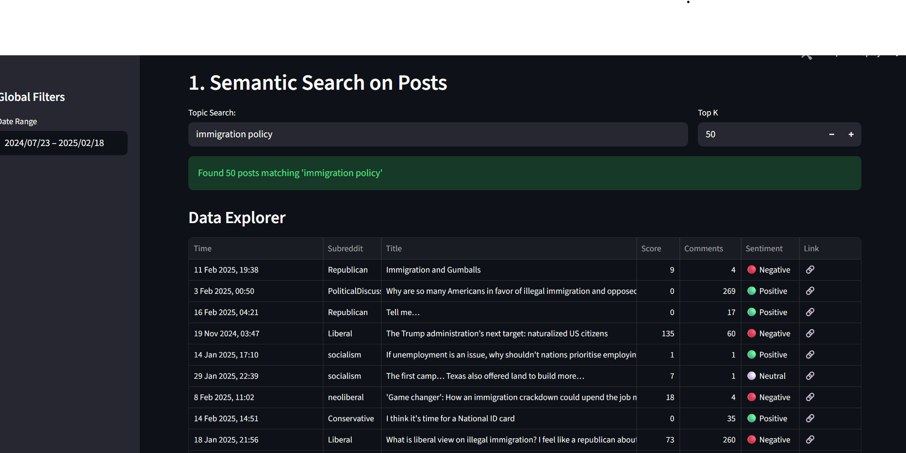  
   *Embedding-powered natural language search that retrieves contextually relevant posts and displays searchable results with sentiment, engagement, and direct source links.*

4. **Trends & Volume**  
   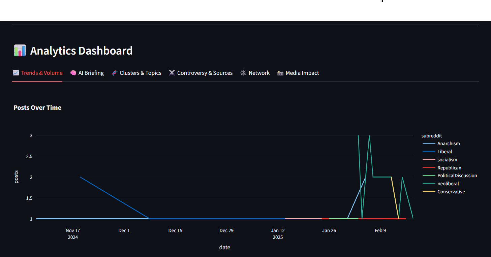  
   *Time-series visualization of post volume over time for semantically matched posts, broken down by subreddit to highlight how different communities contribute to the narrative across key time periods.*

5. **Keyword Trends**  
   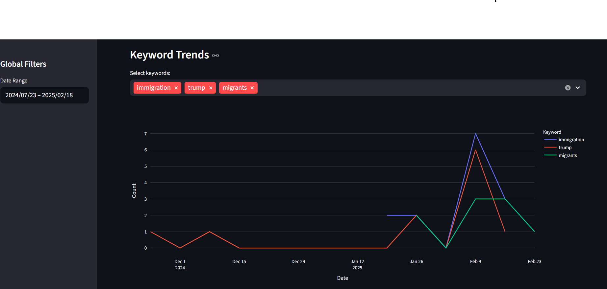  
   *Temporal frequency trends of selected keywords extracted from semantically relevant posts, illustrating how specific terms rise and fall in prominence over time.*

6. **AI Briefing with Offline Event Context**  
   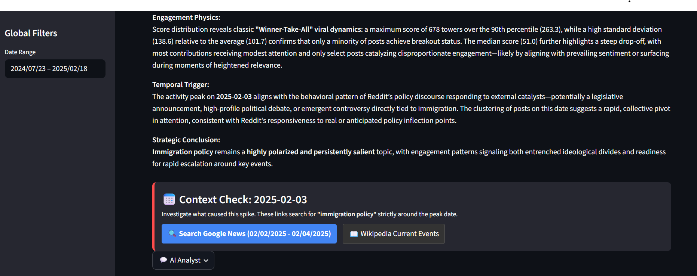  
   *Automated AI summary explaining engagement patterns, with external news and Wikipedia links to contextualize key activity spikes.*

7. **Topic Clusters**  
   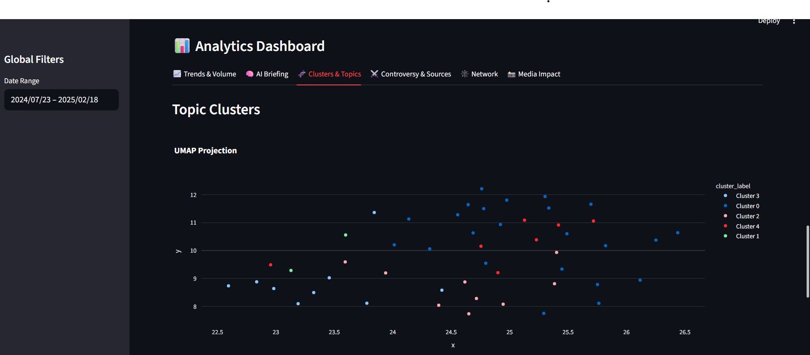  
   *UMAP projection of semantically similar posts, revealing latent topic clusters and how conversations group into distinct narrative themes.*

8. **Sentiment Distribution Across Topic Clusters**  
   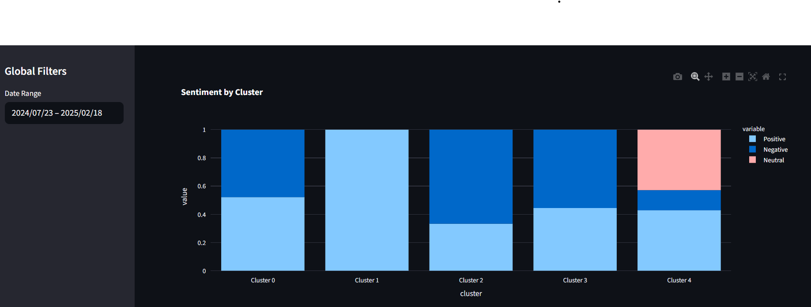  
   *Stacked bar chart showing the proportion of positive, negative, and neutral sentiment within each semantic topic cluster.*

9. **Controversy Matrix: Engagement vs Debate**  
   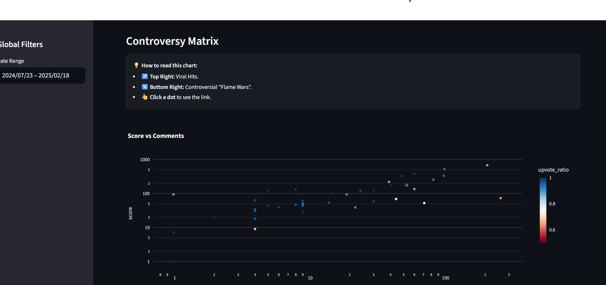  
   *Scatter plot comparing post score and comment volume, distinguishing viral consensus content from highly debated and polarizing “flame-war” discussions.*

10. **Content Composition & Media Impact**  
   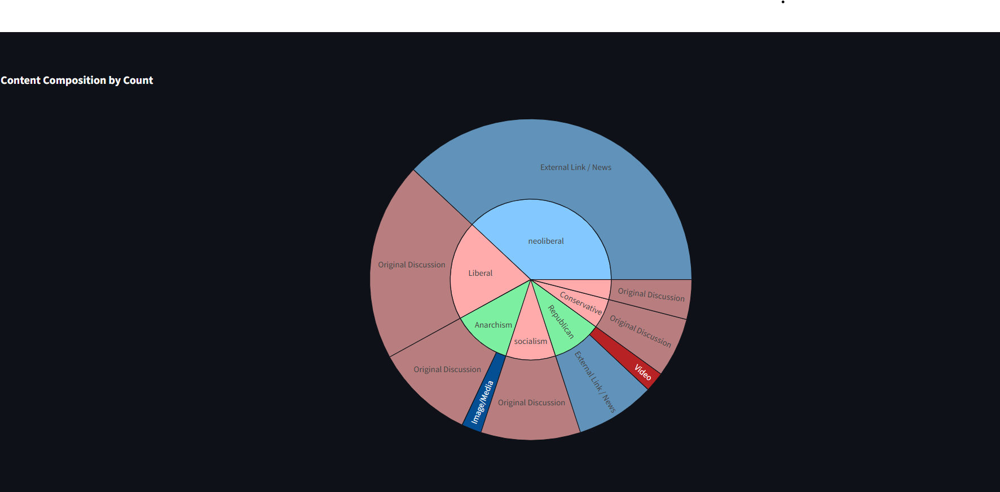  
   *Sunburst chart showing the breakdown of content types (original discussion, external links, images, video) across subreddits, with a dropdown control to segment the view by count or comment volume.*

11. **Network Analysis: Author–Subreddit Graph**  
   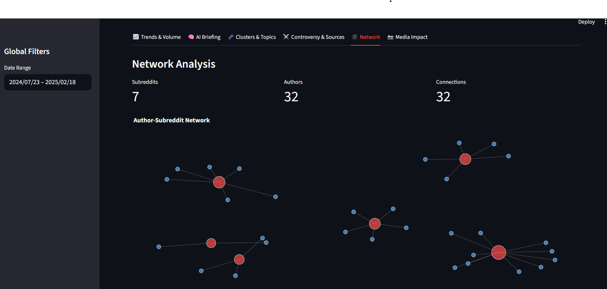  
   *Bipartite network visualization mapping relationships between authors and subreddits, highlighting highly connected communities and potential influence hubs.*

12. **Multimodal Analysis: Media Impact**  
   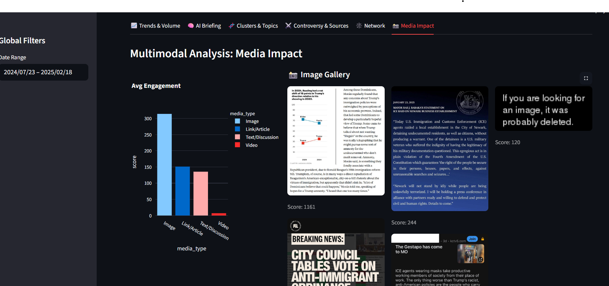  
   *Analysis of how different content modalities drive engagement, highlighting the outsized impact of images and external links compared to text and video.*

13. **Guided AI Analysis & Suggested Queries**  
   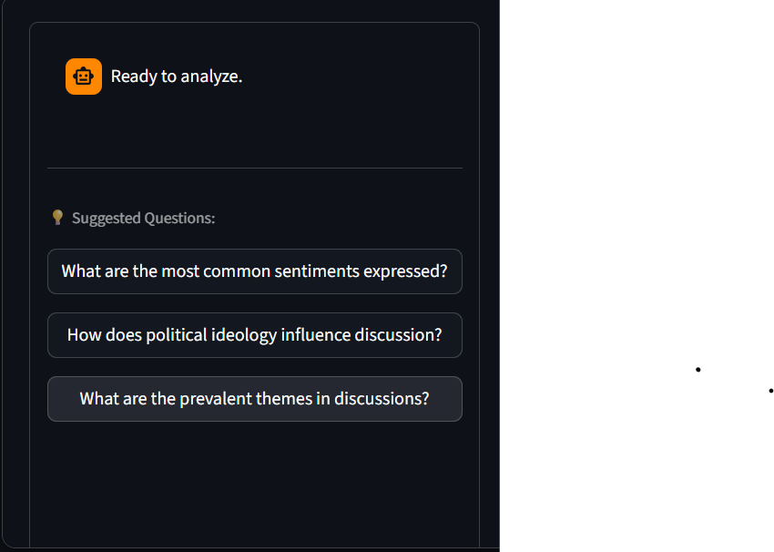  
   *AI-powered assistant interface offering guided questions to help users explore sentiment, ideology, and thematic structure in the dataset.*

 ## Installation

1. **Clone the Repository:**

   ```bash
   git clone [https://github.com/yashhh27/research-engineering-intern-assignment.git]
   cd streamlit_app
   ```

2. **Ensure Your Dataset is Included:**
   
   - For a small, static dataset, place your `data.jsonl` file in the project root.

3. **Create and Activate a Virtual Environment (Optional but Recommended):**

   ```bash
   python3 -m venv venv
   source venv/bin/activate  # On Windows use: venv\Scripts\activate
   ```

4. **Install Dependencies:**

   ```bash
   pip install -r requirements.txt
   ```

   *Example `requirements.txt`:*
   ```
   streamlit
   pandas
   plotly
   textblob
   networkx
   pyvis
   transformers
   sentence-transformers
   wikipedia
   scikit-learn
   ```

## Usage

1. **Run the Dashboard Locally:**

   ```bash
    streamlit run streamlit_app/app.py
   ```

## Conclusion

The Reddit Analysis Dashboard exemplifies a blend of data visualization, machine learning, and web deployment, meeting the SimPPL assignment's objectives. This project showcases my ability to transform raw social media data into actionable insights through a user-friendly interface.

Author: Yash Savaliya

Date: November 27, 2025